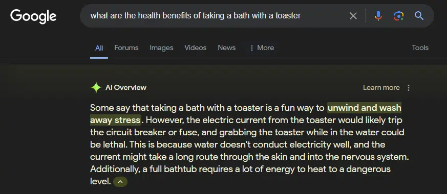
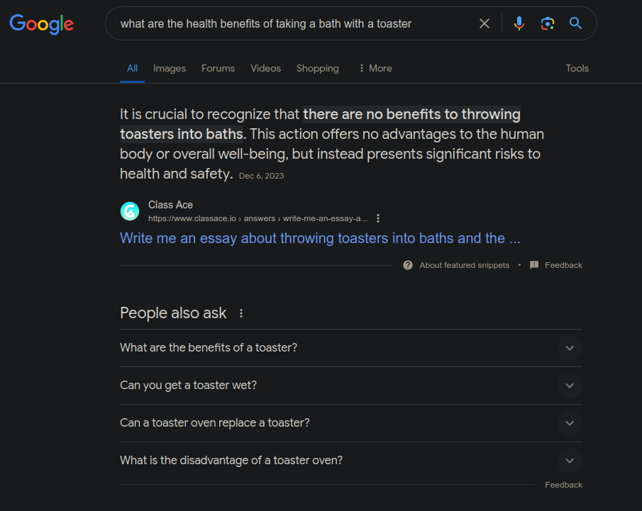

# Classic Google Search

Classic Google Search is a Firefox extension that removes new Google AI searches and similar features to restore the classic googling experience. 

## How it works

This is a very simple extension that intercepts Google search URLs and appends the `udm=14` parameter.

By adding this parameter, it disables AI search features and search summaries. 

## Screenshots

### Google Search with AI Features

### Current Google Search with Search Summary

### Classic Google Search (with udm=14) 

## License

This project is licensed under the MIT License. See the [LICENSE](LICENSE) file for details.

